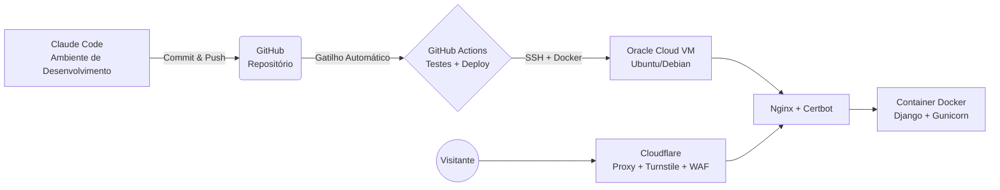

# Central de Chamados — LSERP Sistemas

Projeto da disciplina **Projeto Aplicado: Práticas de Mercado** (Pós-graduação em Segurança da Informação — UNCISAL).

Sistema web de abertura, direcionamento e acompanhamento de chamados de suporte, com três papéis de acesso (administrador, suporte e usuário), autenticação de duplo fator e proteção via Cloudflare, implantado com CI/CD em uma instância Oracle Cloud (Free Tier).

## Sumário

- [Arquitetura](#arquitetura)
- [Stack tecnológica](#stack-tecnológica)
- [Estrutura do repositório](#estrutura-do-repositório)
- [Como rodar localmente](#como-rodar-localmente)
- [Testes](#testes)
- [Infraestrutura e deploy](#infraestrutura-e-deploy)
- [Segurança — mitigações OWASP Top 10:2025](#segurança--mitigações-owasp-top-102025)
- [Checklist de entrega](#checklist-de-entrega)

## Arquitetura



Todo o tráfego público passa obrigatoriamente pela Cloudflare (proxy ativado, modo SSL Full Strict). O Nginx do host só aceita conexões vindas dos ranges de IP da Cloudflare e repassa para o container Django, que fica publicado apenas em `127.0.0.1`.

## Stack tecnológica

- **Backend/Frontend:** Django 5 (server-rendered, monolito)
- **Banco de dados:** SQLite (sem exigência de SGBD dedicado)
- **Autenticação:** usuário/senha + 2FA (TOTP via app autenticador ou código por e-mail) + Cloudflare Turnstile
- **Infraestrutura:** Oracle Cloud Free Tier (Ubuntu/Debian), Docker, Nginx, Certbot
- **CI/CD:** GitHub Actions

## Estrutura do repositório

```
.
├── docs/                  # documentação técnica (infra, segurança, decisões de arquitetura)
├── docker/                # Dockerfile, docker-compose, config de referência do Nginx
├── .github/workflows/     # pipeline de CI/CD
└── src/                   # código-fonte Django
    ├── config/             # settings (base/dev/test/prod), urls, wsgi/asgi
    └── apps/
        ├── core/           # utilitários e modelos-base compartilhados
        ├── accounts/       # autenticação, papéis (RBAC), 2FA
        └── tickets/        # CRUD de chamados
```

Cada app segue a mesma organização interna: `models.py`, `views.py`, `services.py` (regras de negócio, mantendo as views finas), `permissions.py` (quando aplicável) e `tests/`.

## Como rodar localmente

```bash
python -m venv .venv
.venv\Scripts\activate          # Windows
pip install -r requirements-dev.txt
copy .env.example .env
cd src
python manage.py migrate
python manage.py createsuperuser
python manage.py runserver
```

### CSS (Tailwind)

O CSS é compilado com o Tailwind CLI standalone (sem Node.js, sem CDN — ver ADR-011 em
`docs/architecture/decisions.md`). O arquivo compilado (`src/static/css/app.css`) já vem
commitado para o `runserver` funcionar sem passo extra; recompile apenas se mudar classes nos
templates:

```bash
# baixar uma vez: https://github.com/tailwindlabs/tailwindcss/releases (windows-x64)
tailwindcss -i src/tailwind/input.css -o src/static/css/app.css --minify
```

(`src/tailwind/input.css` fica fora de `static/` de propósito — é o arquivo-fonte, não um asset a
ser servido; o Whitenoise quebra se tentar processar um CSS com `@import "tailwindcss"` dentro dele.)

No build da imagem Docker isso é recompilado automaticamente, então a versão commitada nunca é a
fonte de verdade em produção.

## Testes

Desenvolvimento orientado a testes (pytest + pytest-django):

```bash
pytest
pytest --cov=src --cov-report=term-missing
```

## Ambiente de homologação (teste de e-mail)

Para testar o envio real de e-mail (alerta de 2FA incorreto, notificação de login) sem usar a
conta Gmail de produção, use o settings de staging apontado para uma caixa de areia SMTP
(Mailtrap ou Mailpit self-hosted — ver [`docs/architecture/decisions.md`](docs/architecture/decisions.md), ADR-010):

```bash
DJANGO_SETTINGS_MODULE=config.settings.staging python manage.py runserver
```

## Infraestrutura e deploy

Detalhes passo a passo em [`docs/infra/`](docs/infra/):

- [Provisionamento na Oracle Cloud](docs/infra/oracle-cloud-setup.md)
- [Configuração da Cloudflare (DNS, proxy, Turnstile)](docs/infra/cloudflare-setup.md)
- [Hardening de SSH/firewall](docs/infra/ssh-hardening.md)

Decisões de arquitetura registradas em [`docs/architecture/decisions.md`](docs/architecture/decisions.md).

## Gestão de risco

- [Matriz de risco + plano de ação 5W2H](docs/security/risk-matrix.md)
- [Plano de resposta a incidentes](docs/security/incident-response.md)
- [Backup e recuperação](docs/security/backup-recovery.md)
- [O que nunca pode ser commitado](docs/security/nao-commitar.md)
- [Política de divulgação de vulnerabilidade](SECURITY.md)

## Segurança — mitigações OWASP Top 10:2025

> A preencher conforme as features forem implementadas. Detalhamento completo em
> [`docs/security/owasp-mitigations.md`](docs/security/owasp-mitigations.md).

| Categoria OWASP | Onde é mitigada | Como |
|---|---|---|
| _A confirmar_ | | |
| _A confirmar_ | | |
| _A confirmar_ | | |

## Checklist de entrega

- [ ] Aplicação no ar com IP público / domínio (`uncisal.lserpsistemas.com.br`)
- [ ] HTTPS via Certbot com redirecionamento automático
- [ ] Testes SSL/TLS aprovados (Qualys, com PQC)
- [ ] SSH por chave + Fail2Ban configurado
- [ ] Repositório público, `.gitignore` correto, sem segredos expostos
- [ ] Login, página interna autenticada e logout funcionais
- [ ] 3 mitigações OWASP documentadas
- [ ] Pipeline CI/CD automatizado via GitHub Actions
