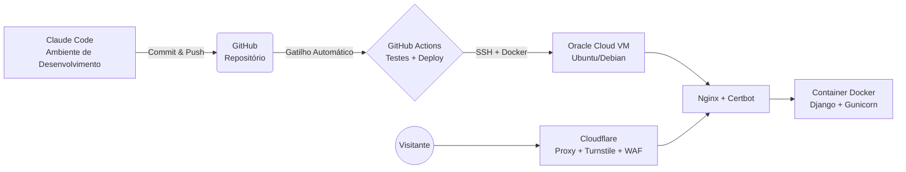

# Central de Chamados — LSERP Sistemas

Projeto da disciplina **Projeto Aplicado: Práticas de Mercado** (Pós-graduação em Segurança da Informação — UNCISAL).

Sistema web de abertura, direcionamento e acompanhamento de chamados de suporte, com três papéis de acesso (administrador, suporte e usuário), autenticação de duplo fator e proteção via Cloudflare, implantado com CI/CD em uma instância Oracle Cloud (Free Tier).

📺 **[Vídeo de apresentação do projeto](https://youtu.be/zeNkYWfGxD4)**

## Sumário

- [Arquitetura](#arquitetura)
- [Stack tecnológica](#stack-tecnológica)
- [Estrutura do repositório](#estrutura-do-repositório)
- [Como rodar localmente](#como-rodar-localmente)
- [Testes](#testes)
- [Infraestrutura e deploy](#infraestrutura-e-deploy)
- [Segurança — mitigações OWASP Top 10:2025](#segurança--mitigações-owasp-top-102025)
- [Checklist de entrega](#checklist-de-entrega)

## Arquitetura



Todo o tráfego público passa obrigatoriamente pela Cloudflare (proxy ativado, modo SSL Full Strict). O Nginx do host só aceita conexões vindas dos ranges de IP da Cloudflare e repassa para o container Django, que fica publicado apenas em `127.0.0.1`.

## Stack tecnológica

- **Backend/Frontend:** Django 5 (server-rendered, monolito)
- **Banco de dados:** SQLite (sem exigência de SGBD dedicado)
- **Autenticação:** usuário/senha + 2FA (TOTP via app autenticador ou código por e-mail) + Cloudflare Turnstile
- **Infraestrutura:** Oracle Cloud Free Tier (Ubuntu/Debian), Docker, Nginx, Certbot
- **CI/CD:** GitHub Actions

## Estrutura do repositório

```
.
├── docs/                  # documentação técnica (infra, segurança, decisões de arquitetura)
├── docker/                # Dockerfile, docker-compose, config de referência do Nginx
├── .github/workflows/     # pipeline de CI/CD
└── src/                   # código-fonte Django
    ├── config/             # settings (base/dev/test/prod), urls, wsgi/asgi
    └── apps/
        ├── core/           # utilitários e modelos-base compartilhados
        ├── accounts/       # autenticação, papéis (RBAC), 2FA, gestão de usuários
        ├── tickets/        # CRUD de chamados
        └── backup/         # backup cifrado agendado + botão manual, Cloudflare R2
```

Cada app segue a mesma organização interna: `models.py`, `views.py`, `services.py` (regras de negócio, mantendo as views finas), `permissions.py` (quando aplicável) e `tests/`.

## Como rodar localmente

```bash
python -m venv .venv
.venv\Scripts\activate          # Windows
pip install -r requirements-dev.txt
copy .env.example .env
cd src
python manage.py migrate
python manage.py createsuperuser
python manage.py runserver
```

### CSS (Tailwind)

O CSS é compilado com o Tailwind CLI standalone (sem Node.js, sem CDN — ver ADR-011 em
`docs/architecture/decisions.md`). O arquivo compilado (`src/static/css/app.css`) já vem
commitado para o `runserver` funcionar sem passo extra; recompile apenas se mudar classes nos
templates:

```bash
# baixar uma vez: https://github.com/tailwindlabs/tailwindcss/releases (windows-x64)
tailwindcss -i src/tailwind/input.css -o src/static/css/app.css --minify
```

(`src/tailwind/input.css` fica fora de `static/` de propósito — é o arquivo-fonte, não um asset a
ser servido; o Whitenoise quebra se tentar processar um CSS com `@import "tailwindcss"` dentro dele.)

No build da imagem Docker isso é recompilado automaticamente, então a versão commitada nunca é a
fonte de verdade em produção.

## Rodando localmente no Windows

Atalhos prontos em [`scripts/windows/`](scripts/windows/) — `dev-up.bat` sobe o servidor de
desenvolvimento (com migrações aplicadas), `dev-down.bat` derruba. Ver o
[`README`](scripts/windows/README.md) da pasta pra detalhes.

## Testes

Desenvolvimento orientado a testes (pytest + pytest-django):

```bash
pytest
pytest --cov=src --cov-report=term-missing
```

## Ambiente de homologação (teste de e-mail)

Para testar o envio real de e-mail (alerta de 2FA incorreto, notificação de login) sem usar a
conta Gmail de produção, use o settings de staging apontado para uma caixa de areia SMTP
(Mailtrap ou Mailpit self-hosted — ver [`docs/architecture/decisions.md`](docs/architecture/decisions.md), ADR-010):

```bash
DJANGO_SETTINGS_MODULE=config.settings.staging python manage.py runserver
```

## Infraestrutura e deploy

Detalhes passo a passo em [`docs/infra/`](docs/infra/):

- [Provisionamento na Oracle Cloud](docs/infra/oracle-cloud-setup.md)
- [Configuração da Cloudflare (DNS, proxy, Turnstile)](docs/infra/cloudflare-setup.md)
- [Hardening de SSH/firewall](docs/infra/ssh-hardening.md)

Decisões de arquitetura registradas em [`docs/architecture/decisions.md`](docs/architecture/decisions.md).

## Status do projeto

- [O que já está pronto e o que falta (com spec mínima de cada pendência)](docs/project/status-e-pendencias.md)
- [Cross-check: enunciado da disciplina × o que foi entregue, item a item](docs/cross-check.md)

## Gestão de risco

- [Matriz de risco + plano de ação 5W2H](docs/security/risk-matrix.md)
- [Plano de resposta a incidentes](docs/security/incident-response.md)
- [Backup e recuperação](docs/security/backup-recovery.md)
- [O que nunca pode ser commitado](docs/security/nao-commitar.md)
- [Política de divulgação de vulnerabilidade](SECURITY.md)

## Segurança — mitigações OWASP Top 10:2025

Detalhamento completo (análise de custo/benefício das 10 categorias, o que foi descartado e por
quê) em [`docs/security/owasp-mitigations.md`](docs/security/owasp-mitigations.md). As 3
obrigatórias + 2 bônus já implementadas:

| Categoria OWASP | Onde é mitigada | Como |
|---|---|---|
| **A01 — Broken Access Control** (Quebra de Controle de Acesso) | `apps/accounts/permissions.py` (`role_required`), `apps/tickets/services.py`/`apps/accounts/services.py` (`UserAdminService`) | RBAC sempre checado no backend, nunca em dado do cliente. Hierarquia de papéis (super-admin > admin > suporte > usuário) com prevenção explícita de escalonamento — admin não cria nem vê conta super-admin, mesmo forjando a requisição direto |
| **A07 — Authentication Failures** (Falhas de Autenticação) | `apps/accounts/services.py` (`TwoFactorService`, `LoginThrottleService`, `TurnstileService`) | 2FA (TOTP/e-mail) + Cloudflare Turnstile + *rate limiting* no login e na verificação do código 2FA |
| **A09 — Security Logging and Alerting Failures** (Falhas de Registro e Alerta de Segurança) | `apps/accounts/models.py` (`LoginAttempt`), tela "Relatório de login" | Auditoria de toda tentativa de login/2FA/recuperação de senha, inclusive contra e-mails inexistentes (detecção de enumeração); alerta por e-mail em login bem-sucedido e em código 2FA incorreto |
| **A05 — Injection** (Injeção) | ORM do Django (todo o projeto), autoescape de template | Nenhum `.raw()`/SQL com string interpolada; nenhum `\|safe`/`mark_safe` em conteúdo de usuário — verificado ao vivo com payload de script numa descrição de chamado, sai escapado |
| **A04 — Cryptographic Failures** (Falhas Criptográficas) | `config/settings/base.py` (`PASSWORD_HASHERS`), `apps/core/fields.py` (`EncryptedCharField`), `apps/backup/services.py` | Argon2id como hasher de senha; segredo TOTP e backup do banco cifrados em repouso, cada um com sua própria chave Fernet dedicada |

## Checklist de entrega

Os 9 itens exatos do "Checklist Final de Entrega" do
[enunciado oficial da disciplina](https://github.com/ziraldocardoso/Projeto_aplicado-praticas_de_mercado/blob/main/Escopo_e_elementos_obrigatorios.md) —
conferência item a item, com evidência de cada um, em [`docs/cross-check.md`](docs/cross-check.md).

- [x] A aplicação Web está no ar e acessível por um IP público (Eixo 1) —
      `163.176.75.32` (reservado) e `uncisal.lserpsistemas.com.br`
- [x] O Web Server (Nginx) está configurado com HTTPS (Certbot/Let's Encrypt) e redireciona o
      tráfego HTTP para HTTPS automaticamente (Eixo 1) — Certbot 5.8.0, renovação automática via
      timer systemd nativo (`snap.certbot.renew.timer`) — ver ADR-027
- [x] Os testes de TLS/SSL retornaram nota A (usamos domínio, não só IP), com PQC ativado
      (Eixo 1) — nota **A+** nos 4 endpoints (IPv4/IPv6), PQC Key Exchange confirmado
      (`X25519MLKEM768`) em 2026-09-22 — print em
      [`docs/security/evidencias/qualys-ssl-report-2026-09-22.png`](docs/security/evidencias/qualys-ssl-report-2026-09-22.png)
- [x] O acesso à nuvem usa boas práticas — chave SSH e Fail2Ban na porta 22 (Eixo 1) —
      `PasswordAuthentication no`, `PermitRootLogin no`, Fail2Ban com `maxretry = 4`/
      `bantime = 24h` (exato da meta mínima), 5 jails ativos, auditoria de menor privilégio
      confirmada (ADR-032)
- [x] O código está versionado em repositório público no GitHub, conta devidamente configurada
      (Eixo 2) — push via PAT (Git Credential Manager), 2FA ativo na conta
- [x] `.gitignore` configurado, sem chaves/senhas expostas no código (Eixo 2) — hooks `gitleaks` +
      `detect-private-key` no pre-commit e no CI
- [x] Aplicação possui Login, Página Interna e Logout, desenvolvida com auxílio de IA via IDE
      (Antigravity ou equivalente) (Eixo 3) — Claude Code, permitido explicitamente pelo
      enunciado como "ambiente similar baseado em IA" (ver ADR-006)
- [x] O README explica quais foram os itens do OWASP Top 10 mitigados e onde encontrá-los no
      código (Eixo 3) — 5 categorias documentadas (mínimo exigido: 3), ver
      [`docs/security/owasp-mitigations.md`](docs/security/owasp-mitigations.md)
- [x] Fluxo de implantação automatizado com CI/CD via GitHub Actions (Integração e Entrega
      Contínuas) — dispara em todo `git push origin main`, `.github/workflows/deploy.yml`
